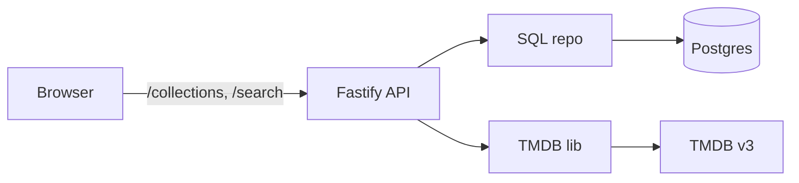
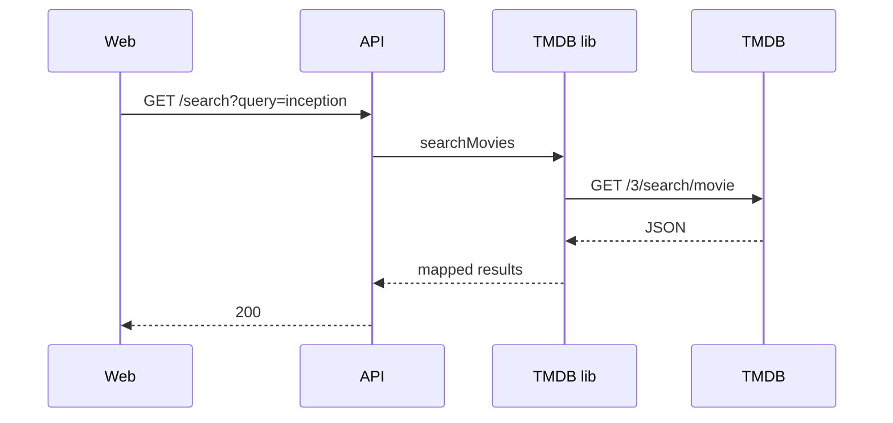
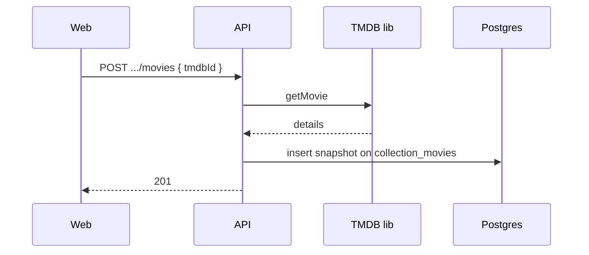
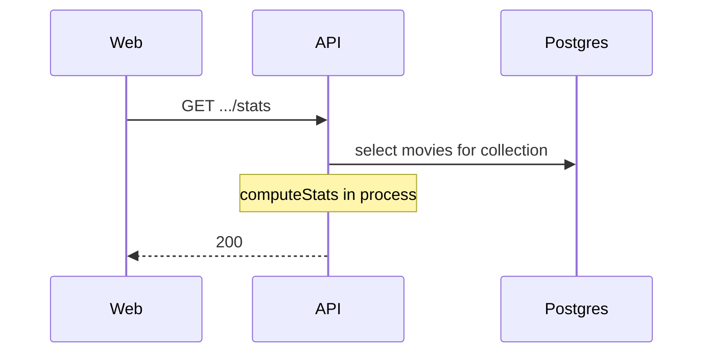
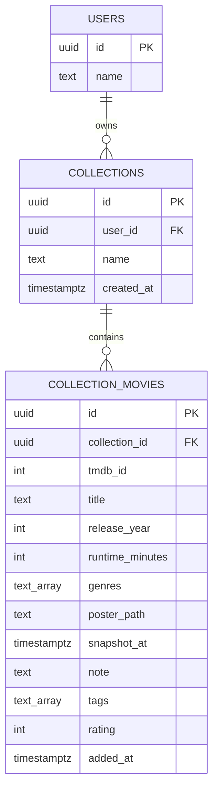

# High-level

A pnpm workspace: TMDB wrapper, Fastify API + Postgres, React SPA, and a shared types package the api and web both import. Browser only talks to our API.

Token stays in the API env. Posters proxy through the API too (`GET /images/:size/:file`), so the browser never hits TMDB's CDN either. Identity is a `/users` list plus an `x-user-id` header — no login.

## Search

## Add movie (snapshot)

Details land on the join row at add time. We don't refetch later. See [DECISIONS.md](DECISIONS.md).

## Stats

No TMDB on this path.

## Schema

`collection_movies` is membership + snapshot + annotations. Unique `(collection_id, tmdb_id)`. Same TMDB id in another collection is another row.

[LLD.md](LLD.md) for internals.
