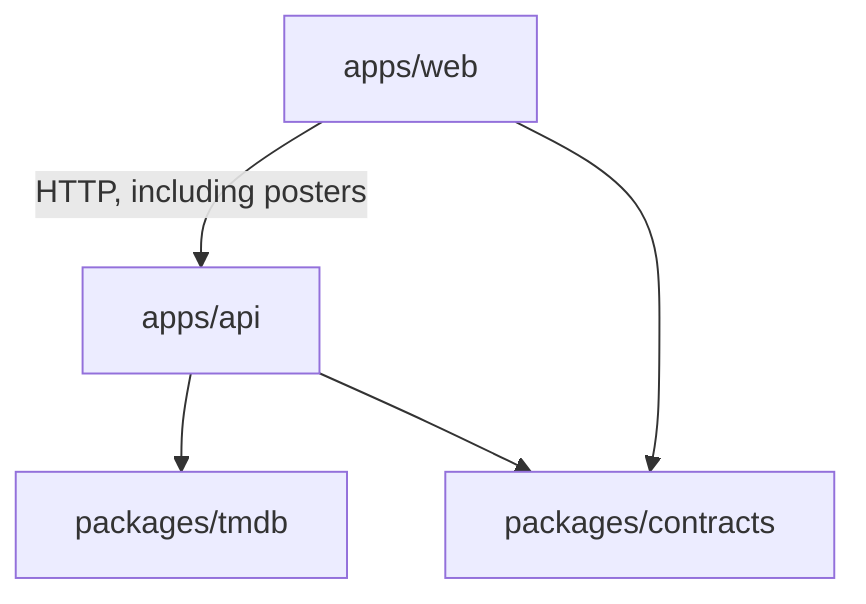
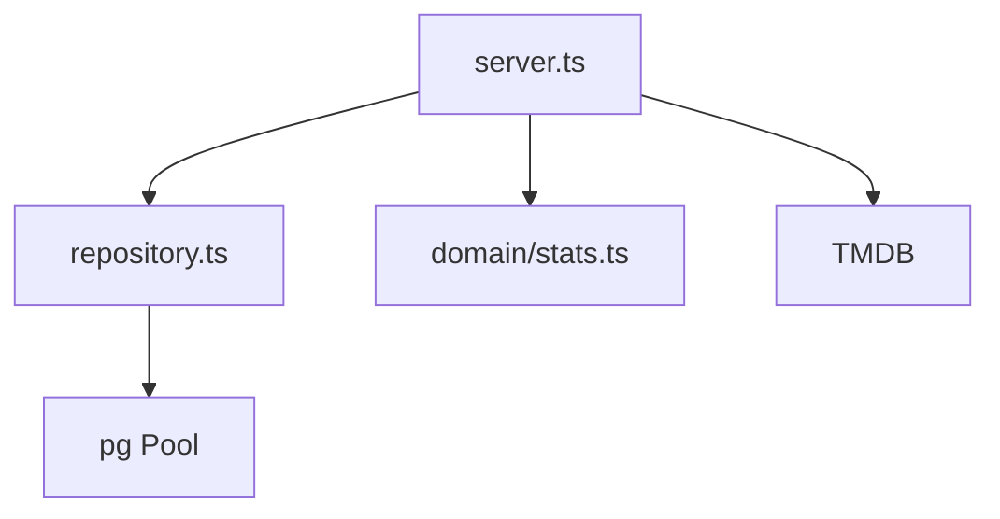

# Internals

Flows and ER are in [HLD.md](HLD.md).

## Packages

The SPA does not depend on `packages/tmdb`. Poster `src`s are API URLs (`/images/...`), built in `api/client.ts`. `packages/contracts` holds the wire types both sides import, so the API and SPA can't drift.

## `packages/tmdb`

Thin client: Bearer token, `fetch` (injectable), Zod on the fields we actually use, map to camelCase types. Failures become `TmdbError` with a `kind` (`auth`, `not_found`, `rate_limited`, `upstream`, `network`, `invalid_response`) so the API doesn't switch on status codes. Transient kinds (network, 429, 5xx) are retried with backoff — 2 extra attempts by default; permanent ones (auth, not_found, bad body) throw straight through. Extra TMDB fields are ignored on purpose so their payload growth doesn't break us. New endpoints would copy `request` + schema + mapper.

## `apps/api`

`buildServer({ repo, users, tmdb })` so tests can `inject` without Postgres. Zod on bodies/queries. Error handler: Zod → 422, TMDB kinds → 404/429/502.

Repo SQL always filters `user_id`. Stats is a pure function. `currentUser.ts` is the identity hook. `migrate.ts` runs unseen `NNN_*.sql` files; `setup.ts` creates the DB then migrates.

| Method | Path | What |
|---|---|---|
| GET/POST | `/users` | list / create (drives the header switcher) |
| GET | `/images/:size/:file` | poster proxy |
| GET | `/search` | TMDB search |
| GET/POST | `/collections` | list / create |
| GET/DELETE | `/collections/:id` | get (with movies) / delete |
| GET | `/collections/:id/stats` | stats |
| POST | `/collections/:id/movies` | add + snapshot |
| DELETE/PATCH | `/collections/:id/movies/:tmdbId` | remove / annotations |

PATCH: rating is nullable, so SQL can't use a plain `coalesce` to clear it. There's a flag for "rating is in this patch." Note and tags still use coalesce (omit = leave alone).

## `apps/web`

`api/client.ts` fetch wrapper. Hooks invalidate collection + stats + list together after mutations. `App.tsx` is `list | collection` in `useState`, no router — two places to be, spec said the URL can stay put. Search input is debounced ~300ms. Rating saves on click; note/tags on blur.

## Tests

- tmdb client: mapping + error kinds, fake `fetch`
- `computeStats`: sums, averages, missing runtime, genre order, year span
- server: inject + stubs (search, 422, add, 404s, TMDB errors, empty-body DELETE, image allow-list)
- **repository integration** (`*.integration.test.ts`): real SQL on a throwaway `<db>_test` —
  ownership isolation, snapshot-on-add, clearing a nullable rating, cross-collection independence,
  idempotent re-add, cascade delete.
- **e2e over HTTP** (`e2e.integration.test.ts`): real Fastify → real repo → real Postgres → real
  stats, only TMDB faked. The whole flow (create user → collection → add → annotate → stats →
  remove → delete) plus per-user privacy.

Integration/e2e files each get their own `<db>_test_<label>` so they run in parallel without
truncating each other, and skip when no Postgres is reachable (unit runs stay infra-free; `pnpm
bootstrap` first to include them). 67 tests in all. Coverage thresholds live in each
`vitest.config.ts` (tmdb 95% lines / 90% branch, api 95% / 90% branch) and fail the build if they slip.

## Gates

Biome for lint + format. `tsc --noEmit` per package. Coverage as above. CI
(`.github/workflows/ci.yml`) runs lint → typecheck → `test:coverage` (unit + integration on a
`postgres:16` service) → build on every push. A `Makefile` wraps the day-to-day commands.
